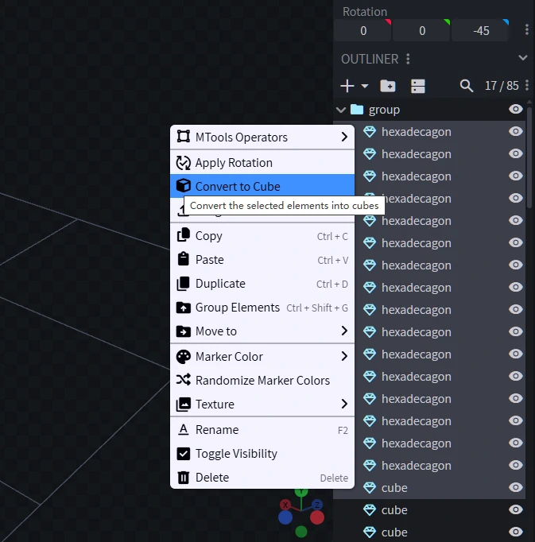

# Convert Mesh to Cube

帮助你将`网格`转换回`块`的 BlockBench 插件。

BlockBench plugin that helps you convert `mesh` back to `cube`.

只需要选中网格，右键，点击“转换成块”，即可将网格转换回块！

Just select meshes, right click, and click "Convert to Cube". That's it!

> [!WARNING]
> 
> 代码由大语言模型生成，只能保证可以转换那些“从块转换为网格”的网格，不支持转换从其它建模软件中导出的网格。
> 
> The plugin is generated by LLM. And it can only ensure that the "meshes that was converted from cubes" are able to convert back to cubes. Meshes from other modeling software are not supported.
> 
> 正因如此，我不想维护这个项目，也不会上传到 BlockBench 插件仓库。
> 
> Because of this, I do not want to maintain the plugin, and I may not upload it to BlockBench plugin repository.
>
